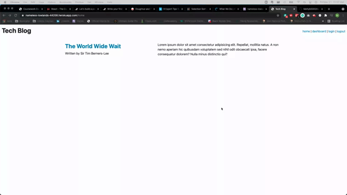

# tech-blog

## Table of Contents
* [Description](#description)
* [Usage](#usage)

## Description

This Tech Blog allows users to sign up to view and create blog posts as well as view comments on their posts. Utilizing handlebars, the site is built to route to different apis when clicking the navigation links or buttons on the pages. This application is hosted on Heroku.

---

## Usage
Visit the deployed Tech Blog [here!](https://nameless-lowlands-44208.herokuapp.com/)

You can click the links in the nav bar to go to various sections of the site. 

---
Follow me on GitHub!

[Mattyb5000](https://github.com/Mattyb5000)

